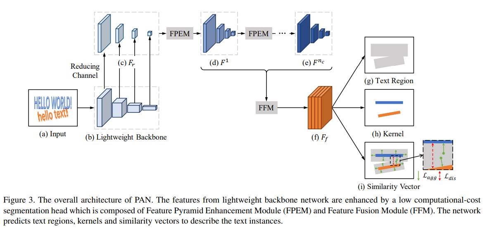

# Efficient and Accurate Arbitrary-Shaped Text Detection with Pixel Aggregation Network



## Requirements
* torch>=1.1.0
* torchvision>=0.3.0
* scikit-image>=0.16.2
* opencv>=3.4.0
* tensorboard>=2.0.1
* pyclipper>=1.1.0
* Polygon3
* Shapely
* tqdm


## Data Preparation

train: prepare a text in the following format, use '\t' as a separator
```bash
/path/to/img.jpg	path/to/label.txt
...
```
val:
use a folder
```bash
img/ store img
gt/ store gt file
```

## Train
1. config the `train_data_path`,`val_data_path`in [config.json](config.json)
2. use following script to run
```sh
python3 train.py
```

## Test

[eval.py](eval.py) is used to test model on test dataset

1. config `model_path`, `img_path`, `gt_path`, `save_path` in [eval.py](eval.py)
2. use following script to test
```sh
python3 eval.py
```

## Predict 
[predict.py](predict.py) is used to inference on single image

1. config `model_path`, `img_path`, in [predict.py](predict.py)
2. use following script to predict
```sh
python3 predict.py
```

The project is still under development.

<h2 id="Performance">Performance</h2>

### [ICDAR 2015](http://rrc.cvc.uab.es/?ch=4)

| Method                   | image size (short size) |learning rate | Precision (%) | Recall (%) | F-measure (%) | FPS | pretrained_model|
|:--------------------------:|:-------:|:--------:|:--------:|:------------:|:---------------:|:-----:|:------:|
| paper(resnet18)  | 736 |x | x | x | 80.4 | 26.1 | x |
| my (resnet18+FPEM_FFM+pse扩张)  |736 |1e-3| 84.86 | 75.8 | 80.09 | x | [pan_icdar2015](https://drive.google.com/open?id=11jiIfndchSdQpSC0PHjSxLljwo4UHXne) |

### CTW1500

| Method                   | image size (short size) |learning rate | Precision (%) | Recall (%) | F-measure (%) | FPS | pretrained_model|
|:--------------------------:|:-------:|:--------:|:--------:|:------------:|:---------------:|:-----:|:-----:|
| paper(resnet18)  | 640 |x | 86.4 | 81.2 | 83.7 | 26.1 | x |
| my (resnet18+FPEM_FFM+pse扩张)  |640 |1e-3| 86.7 | 77.4 | 81.8 | x | [pan_ctw1500](https://drive.google.com/open?id=1w_CHSKmCGwJJndtlkrWAdhshuJm7RATN) |

### [icdar2019](https://rrc.cvc.uab.es/?ch=16)

| Method                   | image size (short size) |learning rate | Precision (%) | Recall (%) | F-measure (%) | FPS | pretrained_model|
|:--------------------------:|:-------:|:--------:|:--------:|:------------:|:---------------:|:-----:|:------:|
| my (resnet18+FPEM_FFM+pse扩张)  |736 |1e-3| 81.6 | 62.3 | 70.7 | x | [pan_icdar2019](https://drive.google.com/open?id=1SfGYGonWJJkjnQSNHok80GxP5SFSiSOh) |


### examples
TBD

### todo
- [ ] EfficientNet backbone
- [ ] ICDAR2019 datasets

### reference
1. https://arxiv.org/pdf/1908.05900.pdf
2. https://github.com/WenmuZhou/PAN.pytorch

**If this repository helps you，please star it. Thanks.**